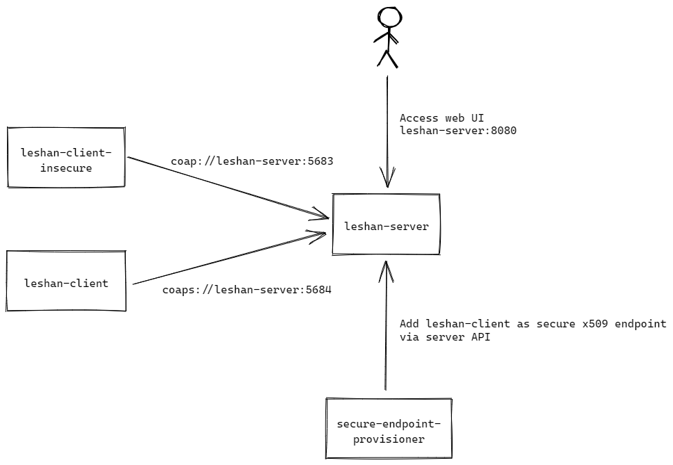
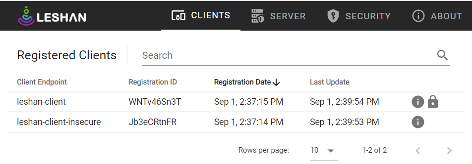

# Lightweight Machine to Machine (LWM2M) Demo

This repository deploys an environment for testing [Lightweight M2M](https://omaspecworks.org/what-is-oma-specworks/iot/lightweight-m2m-lwm2m/) using [Eclipse Leshan](https://github.com/eclipse/leshan).

## Prerequisite

- [Docker Compose CLI plugin](https://docs.docker.com/compose/install/compose-plugin/)

## Instructions

1. Create a directory `.certs`.
1. In the `.certs` directory, follow the instructions [here](https://github.com/eclipse/leshan/wiki/Credential-files-format#using-openssl-to-create-self-signed-certificat) to generate x509 private keys and self-signed certificates in DER format for both client and server, with the following file names:
    | File name | Description |
    | --- | --- |
    | ccert.der | Client certificate with `CN=leshan-client` |
    | cprik.der | Client private key |
    | xcert.der | Server certificate with `CN=leshan-server` |
    | xprik.der | Server private key |
1. Run `docker compose build` to build the L2M2M client and server images.
1. Run `docker compose up` to deploy the following:
    - a Leshan server
    - a Leshan client registering via CoAP (`coap://`)
    - an endpoint provisioner which configures `leshan-client` as a secure x509 endpoint on the Leshan server (required for registration via CoAP over DTLS)
    - a Leshan client registering via CoAP over DTLS (`coaps://`)
1. Browse to [Leshan server web UI](http://localhost:8080) and you should see two clients registered.
    